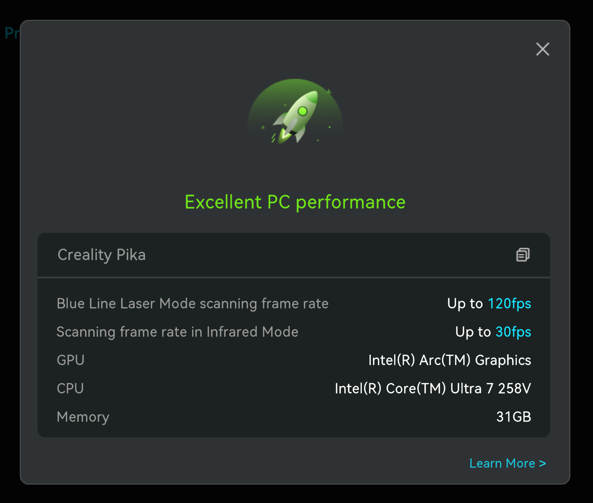

# Unofficial Linux support information for the Creality Scan desktop app

Currently the official app is Windows-only, but can be easily run with modern Wine versions.

The main tricks to get it actually working for scanning are to:
- Attach a recognized GPU & compute platform to it (there is an internal whitelist)
- Ensure `fsync` / `ntsync` is enabled (CPU bottlnecks hard without it)
- Use **_wireless_** scanning mode (USB will be difficult to get working)

If you try getting this working with different hardware / scanners, consider adding notes to Discussions or issues.

# General Info

* This is unofficial, and should be considered experimental and unstable. You should plan to have Windows available as a backup.
* Only the wireless connection mode is possible currently.
    * This works for the Pika -- I'm not sure if other scanners, like a Sermoon + Scan Bridge, connect in the same way.
* The scanner calibration (a required initial setup step) must be done using a USB connection. This should be done on Windows first.
* USB connections are likely difficult to get working properly due to unsupported drivers, and/or getting USB passthrough working.
* Make sure your PC specs are supported with the official app.

# Features Tested

* Currently only tested with:
    * Creality Pika scanner
    * A Intel Lunar Lake laptop, and a Nvidia based desktop (system info below)

```yaml
# System 1 (laptop)
OS: Fedora Linux 44 (Workstation Edition) x86_64
Desktop Environment: GNOME 50.5
CPU: Intel(R) Core(TM) Ultra 7 258V (8) @ 4.80 GHz
GPU: Arc Graphics 130V/140V GPU @ 1.95 GHz
Memory: 32GB

# System 2 (desktop)
OS: Fedora Linux 44 (Workstation Edition) x86_64
Desktop Environment: KDE Plasma 6.7.5
CPU: 12th Gen Intel(R) Core(TM) i9-12900K (16+8) @ 5.20 GHz
GPU 1: NVIDIA GeForce RTX 3080 Lite Hash Rate [Discrete]
GPU 2: Intel UHD Graphics 770 @ 1.55 GHz [Integrated]
Memory: 64GB
```

* Untested as of now:
    * AMD GPU systems
    * Other Creality scanners
        * I have no others, Sermoon + Scan Bridge might work.

# Setup

Package names may differ on other distros.

1. Install dependencies for your platform
    - A supported OpenCL backend
        - Intel GPU (Arc)
            - Fedora: `sudo dnf install intel-compute-runtime`
            - [UNTESTED] Ubuntu: `sudo apt install intel-opencl-icd`
        - Nvidia
            - Fedora: `sudo dnf install xorg-x11-drv-nvidia-cuda-libs`
               - `x11` naming is a historical artifact
               - Probably already installed as part of `akmod` driver
            - [UNTESTED] Ubuntu: `libnvidia-compute-XXX`
               - Probably already installed as dependency of `nvidia-driver-XXX`
        - [UNTESTED] AMD
            - Fedora
                ```sh
                sudo dnf install rocm-opencl rocm-clinfo
                sudo usermod -aG render,video $USER
                # -> log out & log in
                ```
            - Ubuntu 26.04 (24.04 doesn't have this package, install via AMD's ROCm repos): `sudo apt install rocm-opencl-icd`

2. Wine setup

    Install Wine and winetricks

    ```sh
    sudo dnf install wine winetricks
    ```

    NOTE: Other distros may not ship with Wine 11 yet (eg, Ubuntu 26.04 ships Wine 10). Ensure your Wine version is >= 11 (eg WineHQ repos) OR has `fsync` support (enabled with `WINEFSYNC=1`).

    Create prefix and install the app:

    ```sh
    export WINEPREFIX=~/.local/share/wineprefixes/creality-scan
    wineboot -i
    winetricks -q dxvk vcrun2022 corefonts
    wine ~/Downloads/CrealityScan_win_4.3.1.exe
    ```

    Above should add a desktop entry, or launch as usual from a terminal:

    ```sh
    export WINEPREFIX=~/.local/share/wineprefixes/creality-scan
    cd "$WINEPREFIX/drive_c/Program Files/CrealityScan"
    wine CrealityScan.exe
    ```

3. Turn on the scanner in Wireless mode, connect to the hotspot with your Linux desktop.

    If you are getting frequent UI hangs around 30s long, it may be due to a networking quirk.
    * The app will attempt to call home to Creality servers, even while connected to the Pika, and for some reason this can hang the whole UI until the request times out.
    * I fixed this by changing these network settings on the Pika's hotspot (run from the Linux host):
        ```sh
        PIKA_SSID="Pika_ABC123"
        # instant timeouts for the problematic connections
        nmcli con modify "$PIKA_SSID" ipv4.ignore-auto-dns yes ipv6.ignore-auto-dns yes
        # disable powersave, might be helpful in longer sessions
        nmcli con modify "$PIKA_SSID" 802-11-wireless.powersave 2
        # disconnect and reconnect, or run
        nmcli con up "$PIKA_SSID"
        ```

# Troubleshooting / Gotchas

* Frequent 30s UI freezes: see note in step 3 above.
* Wine must support `fsync` / `ntsync`, or performance will be HEAVILY bottlenecked on CPU threading. Wine >= 11 supports `ntsync`, and some older versions have `fsync` (e.g. Proton/GE/Soda) that can be enabled with `WINEFSYNC=1`.
    * Check with `ls -l /proc/$(pgrep -x wineserver)/fd | grep ntsync` while the app is running.
* GPU acceleration
    * Intel (and likely AMD): Use Wine. Bottles Flatpak sandbox can't see the host's OpenCL driver, so the app finds no GPU.
    * AMD: Mesa's rusticl OpenCL driver isn't in the app's platform whitelist, so it'll likely need ROCm's OpenCL, not Mesa. Somehow spoofing the platform name may be another option here.

# Result

I get a very smooth ~60 FPS scanning with blue laser lines (default settings) with both systems, and fusion + meshing + alignment work as expected and produce a good model. This is double the FPS I get with Windows on my laptop, for some reason!

NIR gets 5-10 FPS on my laptop, but works fine with some patience. Smooth 30 FPS on desktop.

So far, with very limited testing, everything seems stable.

The app's built-in benchmark, on my laptop:


